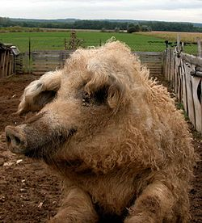

A "hungarikum" a magyarság csúcsteljesítményét jelölő gyűjtőfogalom, amely olyan megkülönböztetésre, kiemelésre méltó értéket jelez, amely a magyarságra jellemző tulajdonság, egyediség, különlegesség és minőség.

